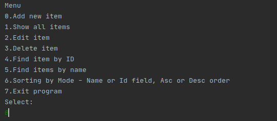
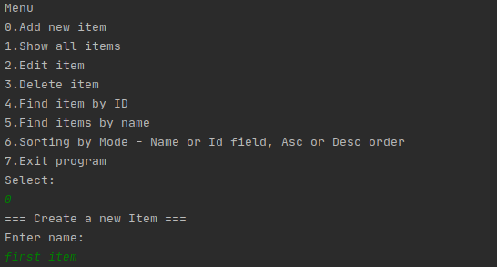
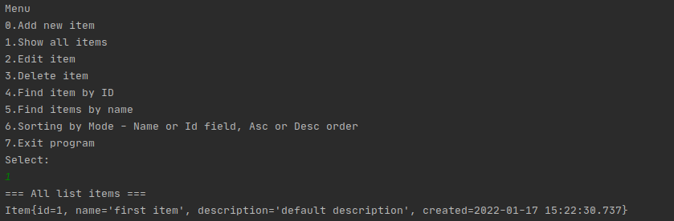
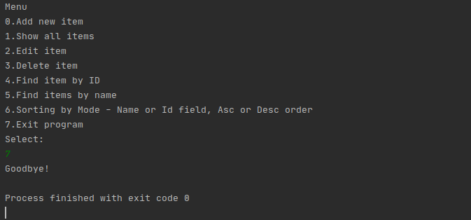

# Приложение job4j_tracker

## О проекте
#### Описание 
Учебный проект - Консольное приложение "Tracker", система для работы с заявками.
Позволяет добавлять, редактировать, удалять, искать и сортировать заявки.
Имеет несколько вариантов хранения данных: в памяти и в базах данных.
Цель проекта: демонстрация основных принципов ООП (особенности архитектуры, 
взаимодействие объектов, модели данных, хранилища и т.д.)

#### Технологии
>JDK14, Maven, PostgreSQL, Hibernate, Liquibase, Java SE, JDBC, Mockito, JUnit4

## Сборка
0. Скачайте исходники
1. Создайте базу данных в соответствии с настройками, указанными в файле *src/main/resources/app.properties*. 
2. Разверните таблицы из файла *db/create.sql*
2. Осуществите сборку приложения: `mvn clean install`
3. Запустите из консоли командой: `java -jar target/junior-2.0.jar`

## Как пользоваться
Работа приложения начинается с главного меню. Для навигации по меню используются цифры:

Для выхода из приложения выберите пункт 7

## Контакты
Кутявин Владимир

email: tribuna87@mail.ru

skype: tribuna87
